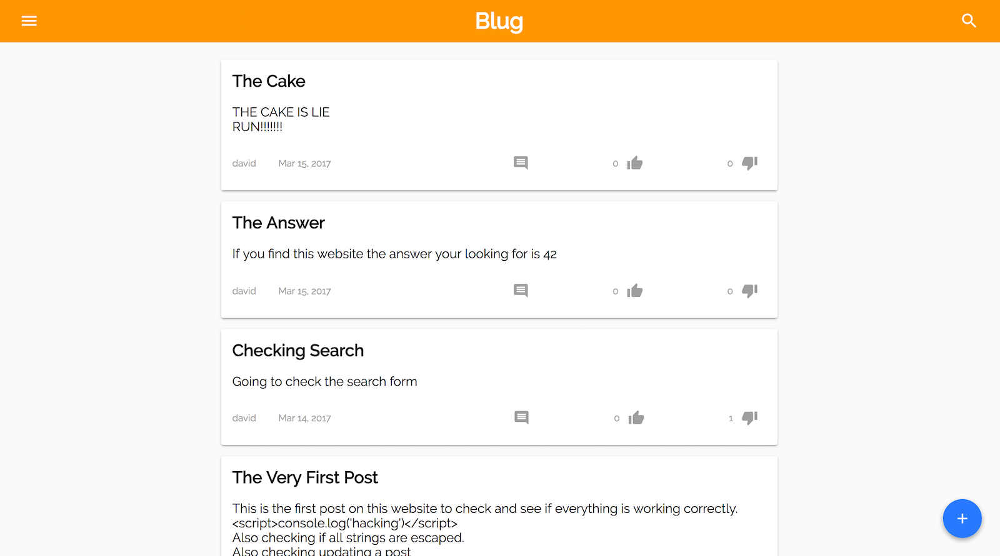
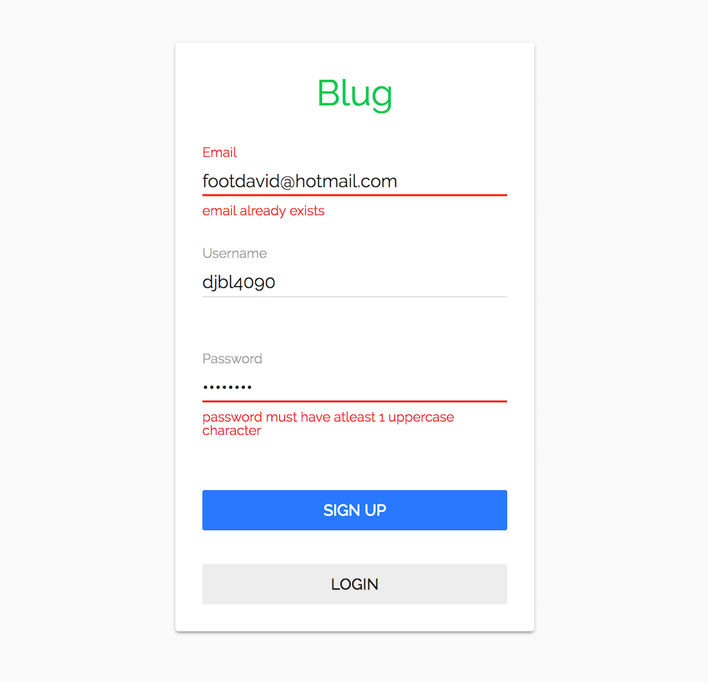

# Blug
> Udacity Fullstack Nanodegree Project 3

This is a simple blog concept app built for the Udacity Fullstack Nanodegree Program. I use the Flask framework for handling the backend and React/Redux for handling the frontend. The data is stored with [Google's Cloud Datastore](https://cloud.google.com/datastore/), a NoSQL database, and it is hosted on [Google's App Engine](https://cloud.google.com/appengine/), a PaaS. You can view the live version [here](https://blog-160318.appspot.com/).

	
	

## Development
The app consists of the basics parts of a blog. Users can log in and signup (no password reset), they can create and edit a post, they can search for a post, and they can comment, like and dislike a post.

### Usage
If you would like to modify or test the app locally just run these steps to get started.

1. Install npm dependencies by running `npm install`
2. Start the webpack dev server by running `npm run start`

To start the backend, you have to have the [Google Cloud SDK](https://cloud.google.com/appengine/docs/standard/python/download) installed on your computer. This link [here](https://cloud.google.com/appengine/docs/standard/python/download) will give you a quick guide on how to install the SDK. Once the SDK is installed, go to the root directory of this project and run `dev_appserver.py app.yaml`. You will be able to view the app at `http://localhost:8080`

### Dependencies
* [NodeJS 6.10](https://nodejs.org/en/)
* [NPM 3.10](https://www.npmjs.com/)
* [Google Cloud SDK](https://cloud.google.com/appengine/docs/standard/python/download)
